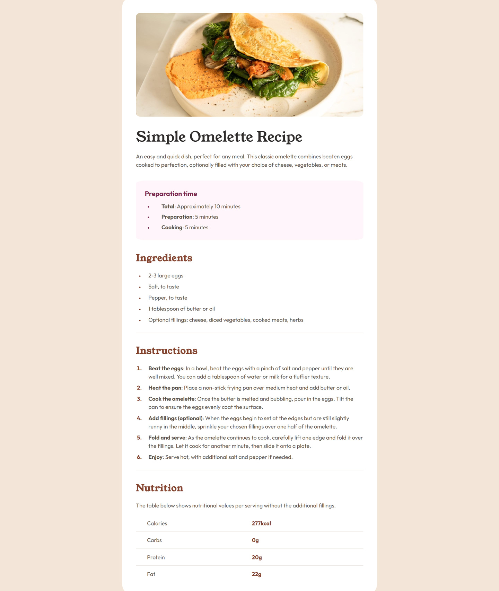

# Frontend Mentor - Recipe page solution

This is a solution to the [Recipe page challenge on Frontend Mentor](https://www.frontendmentor.io/challenges/recipe-page-KiTsR8QQKm). Frontend Mentor challenges help you improve your coding skills by building realistic projects. 

## Table of contents

- [Overview](#overview)
  - [The challenge](#the-challenge)
  - [Screenshot](#screenshot)
  - [Links](#links)
- [My process](#my-process)
  - [Built with](#built-with)
  - [What I learned](#what-i-learned)
- [Author](#author)

## Overview

### Screenshot

### Links

- Solution URL: [https://github.com/appleseed9/recipe-page](https://github.com/appleseed9/recipe-page)
- Live Site URL: [https://appleseed9.github.io/recipe-page/](https://appleseed9.github.io/recipe-page/)

## My process

### Built with

- Semantic HTML5 markup
- CSS custom properties
- Flexbox

### What I learned

I learned about `::marker` pseudo-element, which is very usefull when working with lists.

## Author

- Frontend Mentor - [@appleseed9](https://www.frontendmentor.io/profile/appleseed9)
